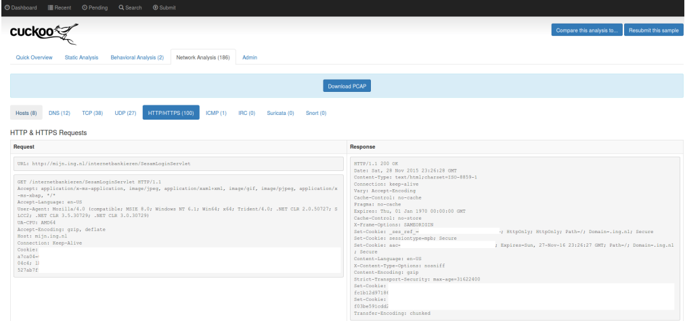

Pengembangan
=============

1.Integration with PCAP analysis tools
^^^^^^^^^^^^^^^^^^^^^^^^^^^^^^^^^^^^^^^

Perkembangan yang dilakukan oleh Cuckoo Sandbox versi 2.0-rc1 adalah mengintegrasi Suricata, Snort, dan Moloch untuk melakukan analisis pada PCAP. Pada versi sebelumnya, jika ingin melihat hasil dari Suricata maka kita diharuskan mengimport secara manual. Namun pada versi terbaru, kita dapat melihat dari Suricata Signature yang ditampilkan. Kita akan dialihkan ke Moloch interface yang secara otomatis akan menampilkan query yang sesuai dengan kriteria yang kita inginkan. Moloch tidak hanya dapat memproses file PCAP saja, namun dapat juga menangkap seluruh traffic jaringan sehingga kemampuan Moloch tidak terbatas. Cuckoo juga menampilkan hasil dari Snort namun tidak seperti Suricata. Snort menjalankan analisis PCAP secara terpisah.

2.Android analysis
^^^^^^^^^^^^^^^^^^^

Cuckoo Droid adalah layanan yang berjalan pada Android Emulator yang dapat melakukan analisis pada actual/native Android dan melakukan intersepsi behaviors dari sample yang dikaitkan dengan Dalvik/Java runtime. Untuk melakukannya, telah dikembangkan melalui eXposed framework yang dimuat pada setiap aplikasi baru.

3.HTTP/HTTPS Decryption and Parsing
^^^^^^^^^^^^^^^^^^^^^^^^^^^^^^^^^^^^

Dengan mencegat kunci enkripsi untuk traffic kami secara efektif dapat mendekripsi traffic HTTPS. Hasil dari analisis tersebut akan dituliskan pada file tlsmaster.txt. Selain cara tersebut, Cuckoo juga menawarkan cara lain, dengan menekstrasi secara manusal dan menampilkan HTTP dan HTTPS stream dari file PCAP. Dekripsi HTTPS Cuckoo Sandbox dapat berjalan dengan mengaktifkan Certificate Pinning.

